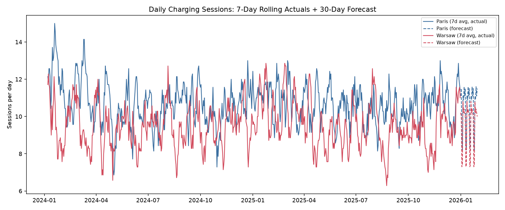

# European EV Mobility & Charging Demand Analytics Platform

[](https://github.com/suhaskosari/european-ev-charging-analytics/actions/workflows/ci.yml)
**[Live dashboard](https://suhaskosari.github.io/european-ev-charging-analytics/)** | [Demand-model validation](outputs/demand_model_validation.md) | [Forecast backtest](outputs/forecast_backtest.md) | [Geospatial stress test](outputs/geospatial_stress_test.md)

An end-to-end analytics platform for a European EV charging network operator:
a Python/SQL data pipeline (with two real REST API integrations), a dbt
dimensional model, statistical demand-driver analysis, Holt-Winters demand
forecasting, geospatial network-expansion analysis, and Power BI dashboards
on top -- with a documented Azure Data Factory / Microsoft Fabric production
architecture alongside the local runnable demo.

Built as a portfolio project on realistic **synthetic** data (no proprietary
data is used) for 8 European cities across 8 countries, 2 years of charging
sessions, EV registrations, energy prices and traffic -- deliberately
generated with the kind of messiness (duplicate rows, mixed timestamp
formats, missing readings, sign errors) a real multi-system export has, so
the cleaning and testing layers have real work to do. Weather data is
**real**, pulled live from the Open-Meteo historical archive API.

See [docs/architecture.md](docs/architecture.md) for the full pipeline
diagram and design rationale, [docs/sample_insights.md](docs/sample_insights.md)
for a generated output example with real numbers, and
[azure/README.md](azure/README.md) for how this maps onto a production
Azure/Fabric deployment.

## Skills demonstrated

`SQL` `Python` `Pandas` `Power BI` `DAX` `Azure` `Microsoft Fabric` `Azure Data Factory` `Data Lake` `Data Warehouse` `dbt` `ETL/ELT` `Data Modelling` `REST APIs` `Git/GitHub` `Statistics` `Forecasting` `Geospatial Analytics` `Data Quality` `Business Intelligence`

## What it does

- **Ingests** charging-session, EV-registration, station, weather, traffic,
  geographic and energy-price data for 8 cities / 8 countries, 2024-2025.
  Station locations pull from the **Open Charge Map** REST API and daily
  weather from the **Open-Meteo** historical archive REST API (both real,
  live calls -- weather runs live with no key needed; stations fall back to
  a deterministic synthetic generator if `OPENCHARGEMAP_API_KEY` isn't set,
  since Open Charge Map now gates most endpoints behind a free key).
- **Cleans** it with pandas: deduplication, mixed-timestamp parsing, casing
  normalization, missing-energy imputation (from duration x rated power, not
  a flat mean), sign-error correction -- every fix logged to
  [outputs/data_quality_report.md](outputs/data_quality_report.md).
- **Models** it as a tested star schema in dbt (DuckDB locally;
  [sql/schema.sql](sql/schema.sql) documents the same shapes as PostgreSQL
  DDL for production), with 25 passing dbt tests (uniqueness, null checks,
  referential integrity).
- **Analyzes** it statistically: a Poisson regression with city fixed effects quantifying what
  drives daily charging demand (about +1.4% sessions per degree below 10 C, -21% on weekends,
  +0.3% per congestion point), validated by checking the estimates against the true parameters
  built into the generator (all four recovered inside the 95% interval; the first pooled OLS
  version was significant but understated the temperature effect ~2.7x). Plus z-score-based
  station-utilization anomaly detection.
- **Forecasts** it: a per-city Holt-Winters (triple exponential smoothing)
  model with weekly seasonality, projecting 30 days of daily charging
  sessions per city -- backtested with a rolling origin against naive baselines
  (WAPE about 28%, MASE 0.71 vs seasonal-naive; daily counts per city are small, so error is noise-limited).
- **Maps** it: demand-weighted KMeans clustering of station locations, with centroids more than 3km
  from the nearest station rendered as candidates on an interactive Folium map. This is a **method
  demonstration**: a permutation test shows the flagged candidates are indistinguishable from chance
  (p = 0.82), because demand in this data does not depend on location. See the stress test.
- **Documents** a production Azure/Fabric deployment: a real, importable ADF
  pipeline definition and a real, runnable Fabric Lakehouse PySpark notebook
  mirroring the local pipeline's Bronze/Silver/Gold stages (see
  [azure/](azure/)) -- not deployed (that needs a billed subscription), but
  concrete code, not a diagram-only claim.
- **Visualizes** it in Power BI: a documented data model, DAX measure
  library, and ready-to-import CSV exports (see [powerbi/](powerbi/)).

## Repository structure

```
european-ev-charging-analytics/
├── python/
│   ├── common.py                  # shared city/date constants
│   ├── fetch_charging_stations.py # real Open Charge Map REST API + synthetic fallback
│   ├── fetch_weather_data.py      # real Open-Meteo historical REST API
│   ├── generate_data.py           # synthetic sessions, EV registrations, energy prices, traffic
│   ├── etl_clean_transform.py     # pandas cleaning: dedupe, timestamps, casing, imputation
│   ├── load_warehouse.py          # loads clean CSVs into DuckDB (raw schema)
│   ├── stats_demand_drivers.py    # OLS demand-driver regression, utilization anomalies
│   ├── forecasting.py             # Holt-Winters 30-day charging-demand forecast per city
│   ├── geospatial_analysis.py     # KMeans demand clustering, haversine, expansion candidates
│   └── export_for_powerbi.py      # exports final marts + outputs to powerbi/exports/
├── sql/
│   └── schema.sql                 # PostgreSQL-compatible dimensional warehouse DDL
├── dbt/ev_analytics/
│   ├── models/staging/            # typed passthroughs from raw sources
│   ├── models/marts/              # dim_*, fct_* dimensional model
│   └── models/marts/analytics/    # station_utilization, regional_demand_monthly,
│                                   #   ev_market_growth, city_daily_demand
├── azure/
│   ├── README.md                  # local-demo -> Azure/Fabric production mapping
│   ├── adf/pipeline_ev_ingestion.json     # real, importable ADF pipeline definition
│   ├── adf/linked_services_and_triggers.md
│   └── fabric/lakehouse_notebook.py       # real, runnable PySpark Bronze->Silver notebook
├── powerbi/
│   ├── data_model.md              # relationships, star schema diagram, Power Query example
│   ├── DAX_measures.md            # full DAX measure library
│   └── exports/                   # CSVs ready for Power BI import
├── docs/
│   ├── architecture.md            # pipeline diagram + design rationale
│   └── sample_insights.md         # generated output example with real numbers
├── outputs/                       # forecast/regression/geospatial CSVs, charts, map, DQ report
└── data/raw/                      # generated + fetched source-system exports
```

## Quickstart

Requires Python 3.11+.

```bash
python -m venv .venv
.venv/Scripts/activate        # Windows; use `source .venv/bin/activate` on macOS/Linux
pip install -r requirements.txt
```

Run the full pipeline end to end:

```bash
python python/fetch_charging_stations.py   # set OPENCHARGEMAP_API_KEY for real station data
python python/fetch_weather_data.py        # real Open-Meteo data, no key needed
python python/generate_data.py
python python/etl_clean_transform.py
python python/load_warehouse.py

cp dbt/profiles.yml.example dbt/profiles.yml
DBT_PROFILES_DIR=dbt dbt run  --project-dir dbt/ev_analytics
DBT_PROFILES_DIR=dbt dbt test --project-dir dbt/ev_analytics

python python/stats_demand_drivers.py
python python/forecasting.py
python python/geospatial_analysis.py
python python/export_for_powerbi.py

python python/eval_demand_model.py   # regression vs generator truth
python python/eval_forecast.py       # rolling-origin backtest
python python/eval_geospatial.py     # permutation stress test
python python/write_sample_insights.py
python python/build_dashboard.py     # regenerates docs/index.html
```

All commands are run from the repo root (dbt-duckdb resolves the warehouse
path relative to your working directory -- see the note in
`dbt/profiles.yml.example` if you relocate things).

Then open Power BI Desktop and follow [powerbi/data_model.md](powerbi/data_model.md)
to import `powerbi/exports/*.csv` and build the relationships/measures.
Open `outputs/station_map.html` directly in a browser for the interactive
geospatial expansion-candidate map.

## Example output

30-day charging-demand forecast on top of 7-day-rolling actuals for the two
busiest cities (`outputs/charging_demand_forecast.png`), generated by
`forecasting.py`:



The corrected demand model (`eval_demand_model.py`) recovers the temperature/traffic/weekday
relationships built into the synthetic generator -- see
[docs/sample_insights.md](docs/sample_insights.md) for the comparison table, the measured forecast
accuracy, and what the geospatial analysis can and cannot say.

## Data provenance

| Source | Real or synthetic |
|---|---|
| Daily weather (8 cities) | **Real**, Open-Meteo historical archive API (live call; synthetic fallback only if the API is unreachable) |
| Charging stations | **Synthetic** unless `OPENCHARGEMAP_API_KEY` is set (Open Charge Map now gates its API behind a free key); this repo's runs use the synthetic fallback |
| Charging sessions, traffic, energy prices, EV registrations | **Synthetic**, seeded generator with deliberately injected defects |

So the only live data in a default run is weather. Headline numbers describe the generator, not a real network, and the effects the models 'recover' are ones the generator built in; the validation scripts exist to check the *methods* against that known truth.

## Testing and CI

```bash
pytest -q          # warehouse integrity, haversine, model-recovery and backtest checks
docker build -t ev-analytics . && docker run --rm ev-analytics   # full pipeline in a container
```

GitHub Actions runs `sh run_pipeline.sh` (ingest, clean, dbt run + 25 dbt tests, analysis, validation, docs, pytest) on every push.

## Design notes

- **Why DuckDB locally / PostgreSQL + Fabric Warehouse in production**: the
  dimensional model is documented as production-ready Postgres DDL
  (`sql/schema.sql`) and as a Fabric Warehouse target (`azure/README.md`),
  but the demo runs on DuckDB so anyone cloning the repo can execute the
  entire pipeline with zero infrastructure -- no database server, no Azure
  subscription, to provision.
- **Real APIs where they're free, synthetic where they aren't**: weather is
  pulled live from Open-Meteo for every run. EV registrations, energy
  prices, traffic and session volumes are synthetic because no free,
  no-signup public API exists at the granularity this platform needs --
  documented explicitly rather than silently passed off as real, and seeded
  with genuine, statistically recoverable relationships (cold weather and
  traffic congestion really do increase simulated demand) so the analysis
  layer has real signal to find.
- **Azure/Fabric is demonstrated as code, not a diagram**: `azure/adf/pipeline_ev_ingestion.json`
  is a valid ADF pipeline definition and `azure/fabric/lakehouse_notebook.py`
  is real PySpark -- neither is deployed (that requires a billed Azure
  subscription), but both are concrete, reviewable artifacts rather than a
  claim made only in prose.
- **Forecasting model choice**: Holt-Winters with weekly seasonality suits a
  2-year daily series with a clear weekday/weekend pattern and no long-range
  trend break -- a lighter, more interpretable choice than reaching for a
  heavier model the data volume doesn't justify.

## License

MIT -- see [LICENSE](LICENSE).
