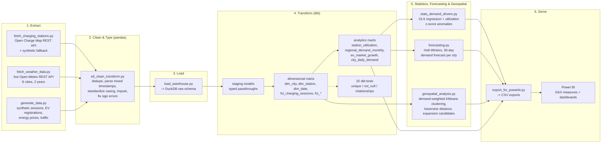

# Architecture

## Pipeline overview

See [azure/README.md](../azure/README.md) for how this same pipeline shape maps
onto Azure Data Factory, ADLS Gen2 (Bronze/Silver/Gold), and Microsoft Fabric
Lakehouse/Warehouse in a production deployment.

## Why this shape

- **ELT, not ETL**: raw data lands in DuckDB largely as-is after a *light*
  Python cleaning pass (fixing genuine data-quality defects only), and the
  *business* transformation -- the star schema, utilization/demand KPIs,
  market-growth logic -- lives in version-controlled, tested dbt SQL. This
  mirrors a production warehouse (Fabric Warehouse/Synapse/Postgres + dbt);
  DuckDB is swapped in purely so the whole pipeline runs locally.
- **Real REST APIs where they're free, synthetic where they aren't**: weather
  comes from Open-Meteo's real historical archive (no key required) for all
  8 cities. Charging-station location pulls from Open Charge Map, which now
  gates most endpoints behind a free API key -- if `OPENCHARGEMAP_API_KEY`
  isn't set, `fetch_charging_stations.py` falls back to a deterministic
  synthetic generator, the same fallback pattern used for exchange rates in
  the sibling e-commerce repo. EV registrations, energy prices, traffic and
  charging-session volumes are generated synthetically (no free, no-signup
  API exists for these at the granularity this platform needs) but are
  seeded to correlate realistically: colder weather and higher traffic
  congestion both genuinely increase simulated charging demand, and
  `stats_demand_drivers.py`'s OLS regression recovers exactly that
  relationship, with p < 0.001 on both coefficients -- see
  [docs/sample_insights.md](sample_insights.md).
- **DuckDB locally, PostgreSQL-shaped in `sql/schema.sql`**: the dimensional
  model is documented as standard Postgres DDL for a production deployment;
  DuckDB exists purely so the repo is runnable by anyone who clones it, with
  no database server to stand up.
- **Statistics and forecasting are the analysis layer, not a black box**:
  `stats_demand_drivers.py` fits an interpretable OLS model (temperature,
  precipitation, congestion, weekday) rather than an opaque ML model, because
  the deliverable here is "which levers actually move charging demand,"
  which needs coefficients and p-values, not just a prediction.
  `forecasting.py` uses Holt-Winters (triple exponential smoothing) with
  weekly seasonality -- appropriate for a signal this short (2 years) and
  this seasonally regular, rather than reaching for a heavier model the data
  volume doesn't justify.
- **Geospatial analysis answers a concrete infrastructure question**:
  `geospatial_analysis.py` doesn't just plot stations on a map -- it
  clusters *demand* (session-volume-weighted station coordinates) and flags
  cluster centroids more than 3km from the nearest existing station as
  expansion candidates, which is the actual decision a network-planning
  team would use this for.
- **Reproducible by construction**: `generate_data.py`, the regression, and
  the clustering are all seeded/deterministic, so re-running the pipeline
  from scratch reproduces the same numbers referenced in
  [docs/sample_insights.md](sample_insights.md).

## Data quality issues deliberately injected (and how they're caught)

| Issue | Where it's introduced | Where it's caught/fixed |
|---|---|---|
| Duplicate session rows (CPO integration retry-on-timeout bug) | `generate_data.py` | `etl_clean_transform.py` dedupes on `session_id`, logged in `outputs/data_quality_report.md` |
| Mixed timestamp formats (ISO with fractional seconds vs. `DD/MM/YYYY HH:MM`) | `generate_data.py` | `etl_clean_transform.py::parse_mixed_timestamp` |
| Duplicate station rows + inconsistent connector-type casing (`chademo` vs. `CHAdeMO`) | `generate_data.py` / `fetch_charging_stations.py` | `etl_clean_transform.py::clean_stations` |
| Missing energy_kwh readings (meter read failures) | `generate_data.py` | imputed from `duration_min x rated power_kw`, not a flat mean fill |
| Sign-error costs (billing refund coded as negative charge) | `generate_data.py` | corrected via `abs()`, counted in the data-quality report |
| Missing daily temperature readings | (rare Open-Meteo gaps) | `etl_clean_transform.py::clean_weather` interpolates + forward/back-fills per city |
| Cold-snap and gas-supply-shock energy price spikes (Jan 2024, Feb 2025) | `generate_data.py::generate_energy_prices` | visible directly in `fct_energy_prices` / the Power BI energy-price trend page |
