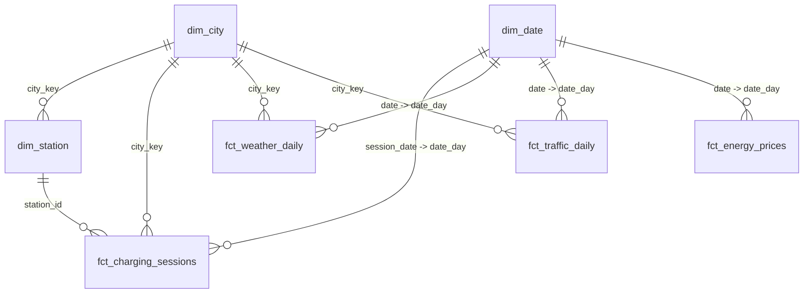

# Power BI Data Model

## Importing the data

1. Run the pipeline once (see the [root README](../README.md)) so `powerbi/exports/*.csv` is populated, or use the CSVs already committed in this repo.
2. In Power BI Desktop: **Get Data -> Text/CSV**, import every file in `powerbi/exports/`.
3. Set data types on import: `date` / `session_date` / `date_day` / `month` columns as **Date**, `*_eur` / `*_kwh` columns as **Fixed decimal number**, id/key columns as **Text** (so they aren't summed).
4. Mark `dim_date` as a **Date table** (Table tools -> Mark as date table -> `date_day`).
5. Build the relationships below in **Model view**.

## Star schema



| From | To | Cardinality | Cross-filter |
|---|---|---|---|
| `dim_station[city_key]` | `dim_city[city_key]` | many:1 | single |
| `fct_charging_sessions[station_id]` | `dim_station[station_id]` | many:1 | single |
| `fct_charging_sessions[city_key]` | `dim_city[city_key]` | many:1 | single |
| `fct_charging_sessions[session_date]` | `dim_date[date_day]` | many:1 | single |
| `fct_weather_daily[date]` | `dim_date[date_day]` | many:1 | single |
| `fct_weather_daily[city_key]` | `dim_city[city_key]` | many:1 | single |
| `fct_traffic_daily[date]` | `dim_date[date_day]` | many:1 | single |
| `fct_traffic_daily[city_key]` | `dim_city[city_key]` | many:1 | single |
| `fct_energy_prices[date]` | `dim_date[date_day]` | many:1 | single |
| `fct_ev_registrations[country_code]` | `dim_city[country_code]` | many:many (no dim_country table -- relate on the text column, cross-filter both directions) | both |

The `station_utilization`, `regional_demand_monthly`, `ev_market_growth`, and
`city_daily_demand` tables are pre-aggregated analytics marts (already
business-logic-complete from dbt) -- use them directly on report pages that
don't need row-level drill-through, and keep them **disconnected** from the
star schema to avoid ambiguous filter paths, or relate them read-only via
`station_id`/`city_key` where drill-through is wanted.

The Python-layer outputs -- `charging_demand_forecast.csv`,
`station_expansion_candidates.csv`, `station_utilization_anomalies.csv`,
`demand_drivers_regression.csv` -- are also disconnected tables, each
already at the grain its own report visual needs (forecast page, geospatial
expansion map, anomaly table, regression coefficient chart).

## Suggested pages

1. **Network Overview** -- `city_daily_demand` / `fct_charging_sessions`: total sessions, energy delivered, revenue, sessions trend, city breakdown map (use `dim_city[latitude]`/`[longitude]`).
2. **Station Utilization** -- `station_utilization`: utilization-rate heatmap by station/city, busiest-hour analysis from `fct_charging_sessions[session_hour]`, underutilized-station leaderboard.
3. **Demand Drivers & Forecast** -- `city_daily_demand` scatter (sessions vs. temperature/congestion) + `charging_demand_forecast.csv` line chart (actual vs. forecast per city) + `demand_drivers_regression.csv` as a coefficient bar chart.
4. **Network Expansion (Geospatial)** -- `dim_station` on a map visual (bubble size = utilization) overlaid with `station_expansion_candidates.csv` (filter `expansion_candidate = TRUE`) as a second map layer; embed or link `outputs/station_map.html` for the interactive Folium version.
5. **EV Market & Energy Prices** -- `ev_market_growth`: BEV/PHEV registrations trend and MoM growth by country; `fct_energy_prices`: wholesale price trend with the two injected spike windows visible.
6. **Data Quality** -- `station_utilization_anomalies.csv` overlaid on the utilization trend (see `docs/architecture.md` for how these are computed) and a summary card sourced from `docs/../outputs/data_quality_report.md`'s counts.

## Power Query (M) example

A small example of a Power Query transformation used when pulling
`fct_charging_sessions.csv` directly (rather than the already-clean export)
-- demonstrates the Power Query skill alongside the Python/dbt cleaning
already done upstream:

```m
let
    Source = Csv.Document(File.Contents("fct_charging_sessions.csv"), [Delimiter=",", Columns=15, Encoding=65001, QuoteStyle=QuoteStyle.None]),
    PromotedHeaders = Table.PromoteHeaders(Source, [PromoteAllScalars=true]),
    TypedColumns = Table.TransformColumnTypes(PromotedHeaders, {
        {"session_date", type date},
        {"energy_kwh", type number},
        {"cost_eur", type number}
    }),
    FilterFastChargers = Table.SelectRows(TypedColumns, each [charger_class] <> "Standard (<50kW)")
in
    FilterFastChargers
```
